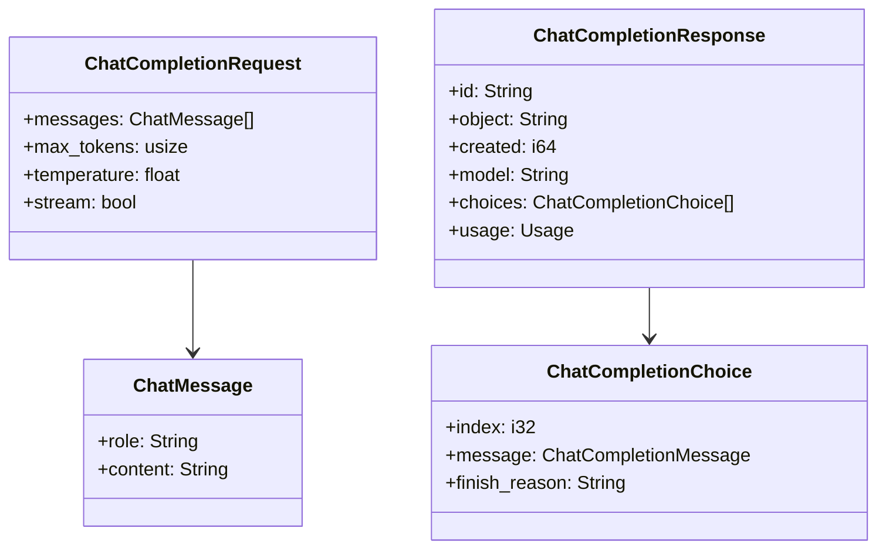
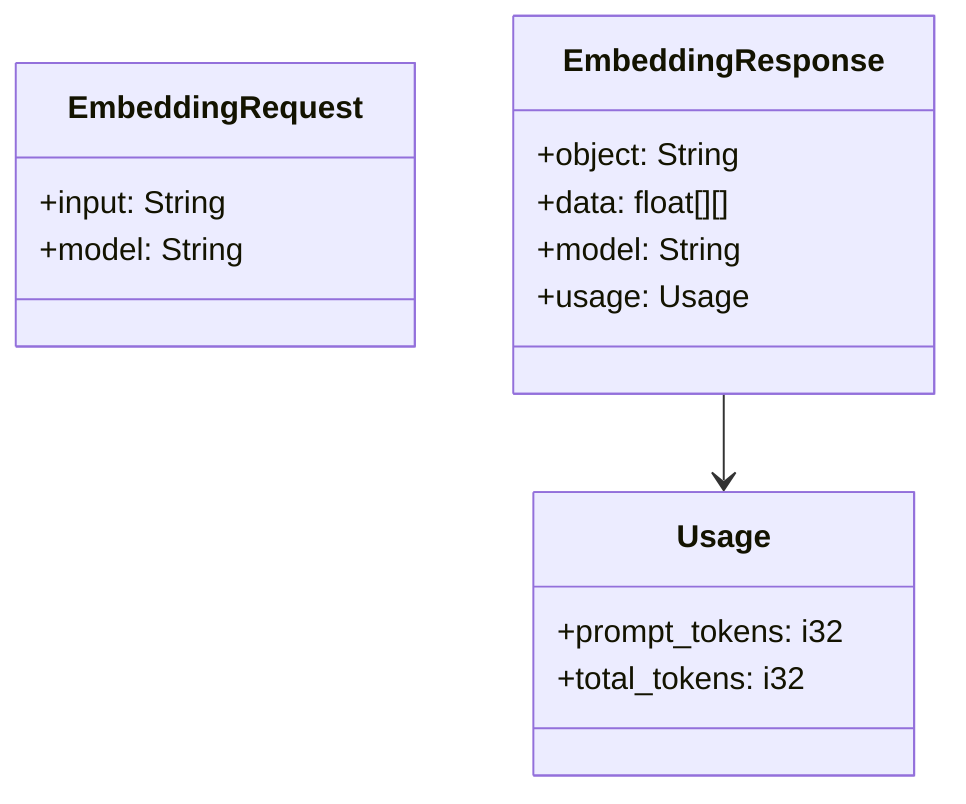
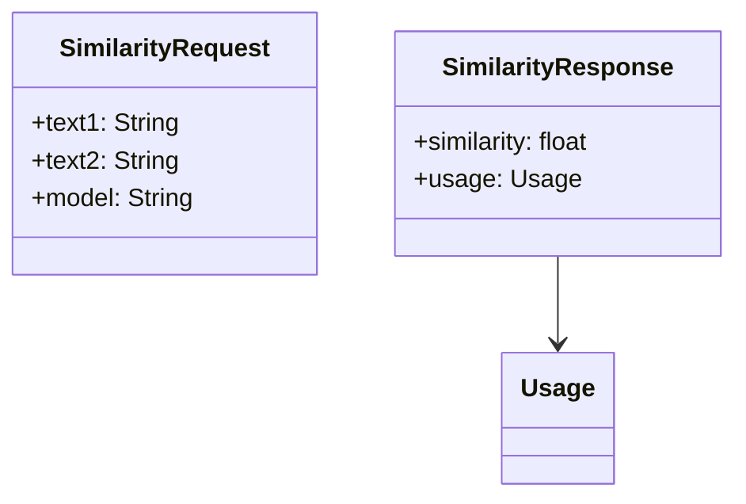
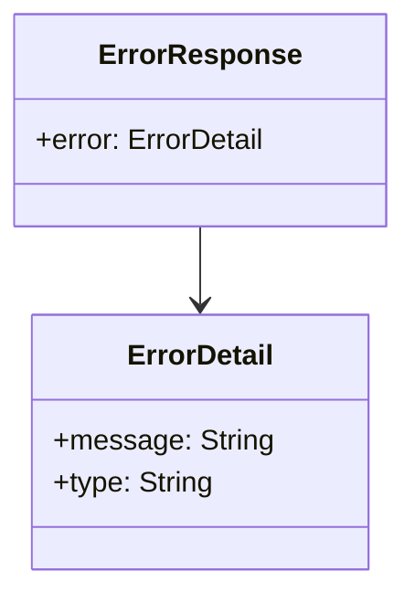

# API Documentation

## Overview

The FastLLM API provides endpoints for chat completions and embeddings generation. The API is built using Axum and follows RESTful principles.

## Endpoints

### Chat Completions

#### POST /v1/chat/completions

Creates a chat completion for the given conversation.



**Request Format:**
```json
{
    "messages": [
        {
            "role": "system",
            "content": "You are a helpful assistant."
        },
        {
            "role": "user",
            "content": "Hello!"
        }
    ],
    "max_tokens": 100,
    "temperature": 0.7,
    "stream": false
}
```

**Response Format:**
```json
{
    "id": "chatcmpl-123",
    "object": "chat.completion",
    "created": 1677652288,
    "model": "mistral-7b",
    "choices": [{
        "index": 0,
        "message": {
            "role": "assistant",
            "content": "Hello! How can I assist you today?"
        },
        "finish_reason": "stop"
    }],
    "usage": {
        "prompt_tokens": 9,
        "completion_tokens": 12,
        "total_tokens": 21
    }
}
```

### Embeddings

#### POST /v1/embeddings

Generates embeddings for the input text.



**Request Format:**
```json
{
    "input": "The quick brown fox jumps over the lazy dog",
    "model": "mistral-7b"
}
```

**Response Format:**
```json
{
    "object": "embedding",
    "data": [
        [0.0023064255, -0.009327292, ...]
    ],
    "model": "mistral-7b",
    "usage": {
        "prompt_tokens": 9,
        "total_tokens": 9
    }
}
```

#### POST /v1/similarity

Computes similarity between two texts using their embeddings.



**Request Format:**
```json
{
    "text1": "The quick brown fox",
    "text2": "The fast brown fox",
    "model": "mistral-7b"
}
```

**Response Format:**
```json
{
    "similarity": 0.89,
    "usage": {
        "prompt_tokens": 18,
        "total_tokens": 18
    }
}
```

## Error Handling

The API uses a standardized error response format:



**Error Response Format:**
```json
{
    "error": {
        "message": "Invalid request parameters",
        "type": "invalid_request_error"
    }
}
```

## Request Flow

```mermaid
sequenceDiagram
    participant Client
    participant Router
    participant Handler
    participant Model
    participant Response
    
    Client->>Router: HTTP Request
    Router->>Handler: Route Request
    Handler->>Model: Process Request
    Model-->>Handler: Generate Result
    Handler-->>Response: Format Response
    Response-->>Client: HTTP Response