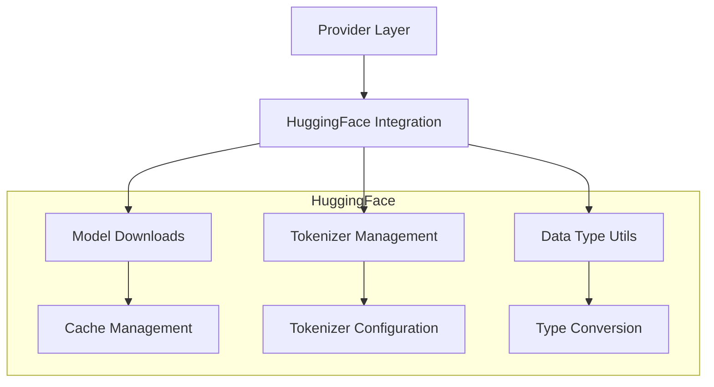
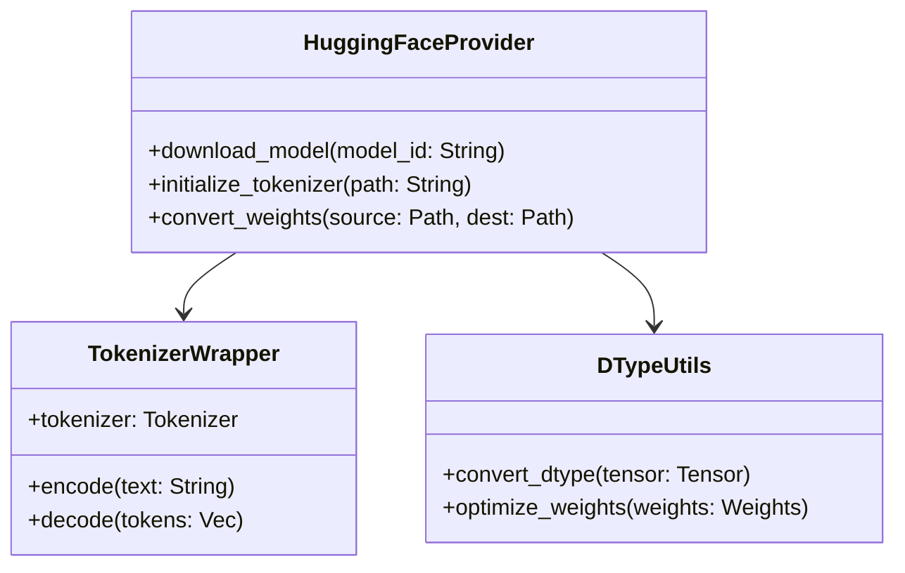
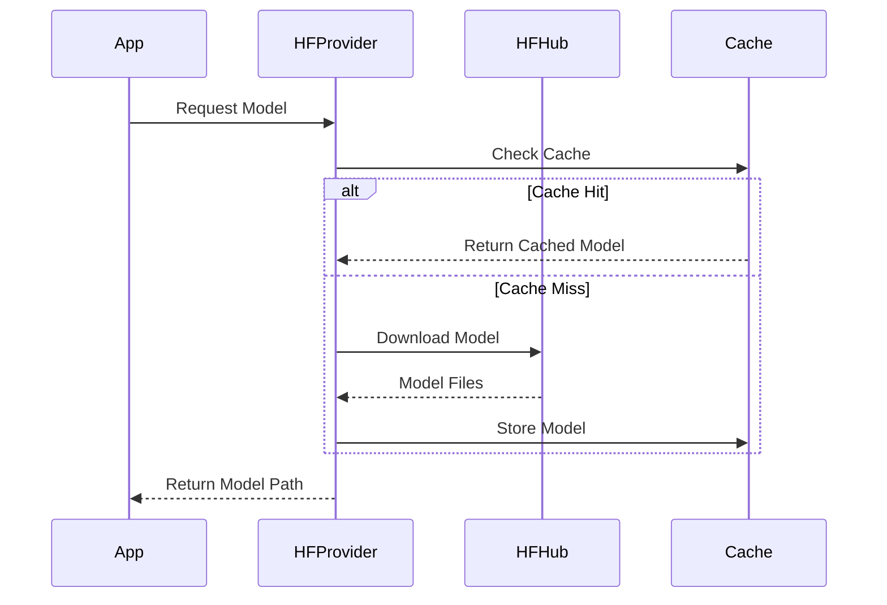
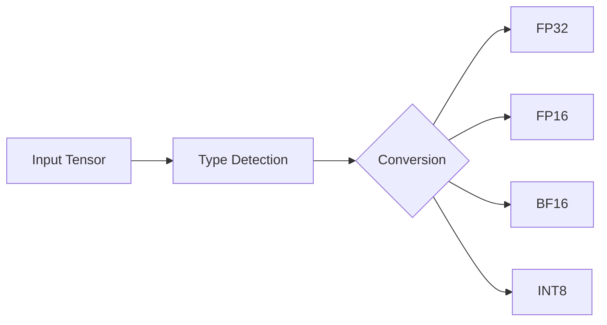
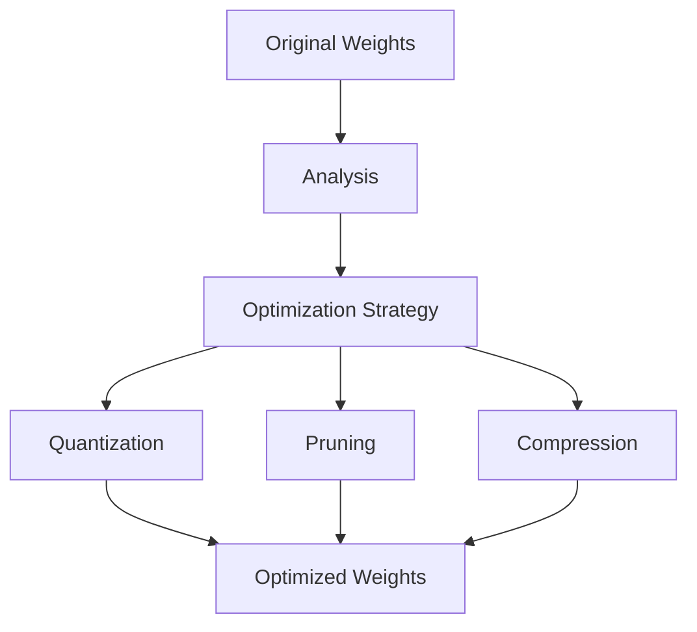
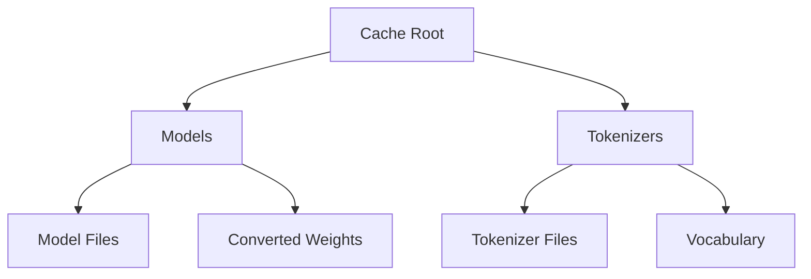

# Providers Documentation

## Overview

The Providers module handles integration with external model hosting services, primarily focusing on HuggingFace Hub integration. It manages model downloads, tokenizer initialization, and data type conversions.

## Architecture



## HuggingFace Integration

### Components



### Model Download Process



## Tokenizer Implementation

The tokenizer implementation provides efficient text tokenization and detokenization capabilities.

### Key Features

- Fast tokenization using HuggingFace tokenizers
- Support for different tokenizer types
- Efficient batch processing
- Special token handling

### Usage Example

```rust
let tokenizer = TokenizerWrapper::new("path/to/tokenizer.json")?;

// Encode text to tokens
let tokens = tokenizer.encode("Hello, world!")?;

// Decode tokens back to text
let text = tokenizer.decode(&tokens)?;
```

## Data Type Utilities

The `dtype_utils` module provides utilities for handling different data types and conversions between them.

### Supported Operations



### Weight Optimization



## Cache Management

The provider implements a caching system to avoid redundant downloads and conversions.

### Cache Structure



### Configuration

The cache system can be configured through environment variables:

```bash
FASTLLM_CACHE_DIR=/path/to/cache  # Custom cache directory
FASTLLM_OFFLINE=1                 # Offline mode
FASTLLM_NO_CACHE=1               # Disable caching
```

## Error Handling

The provider implements comprehensive error handling for various scenarios:

- Network connectivity issues
- Invalid model configurations
- File system errors
- Token validation errors

Example error handling:

```rust
#[derive(Debug, Error)]
pub enum ProviderError {
    #[error("Failed to download model: {0}")]
    DownloadError(String),
    
    #[error("Invalid tokenizer configuration: {0}")]
    TokenizerError(String),
    
    #[error("Cache error: {0}")]
    CacheError(String),
}
```

## Best Practices

1. **Model Management**
   - Use cached models when possible
   - Implement proper cleanup of temporary files
   - Handle large downloads with progress indicators

2. **Tokenizer Usage**
   - Reuse tokenizer instances when possible
   - Implement proper error handling for special tokens
   - Consider batch processing for multiple inputs

3. **Type Conversions**
   - Validate tensor shapes before conversion
   - Handle numerical precision carefully
   - Implement proper error handling for edge cases

4. **Cache Management**
   - Implement cache size limits
   - Regular cleanup of unused cached files
   - Proper handling of concurrent access