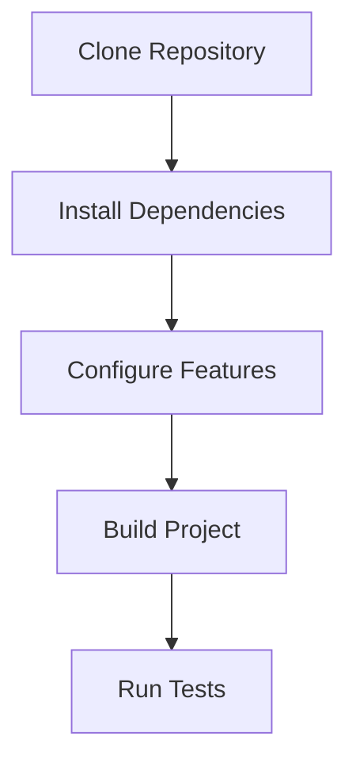
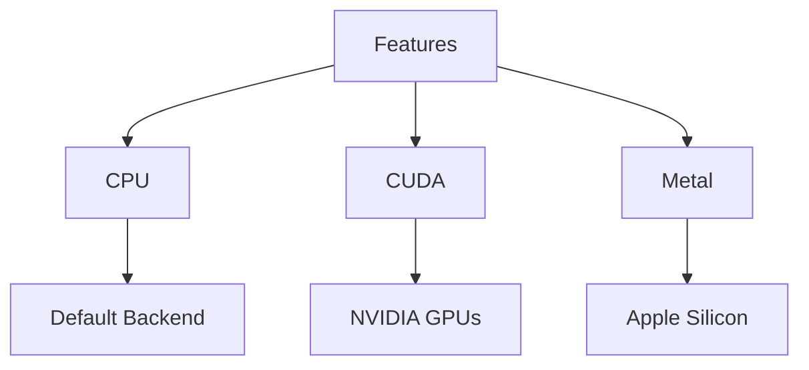
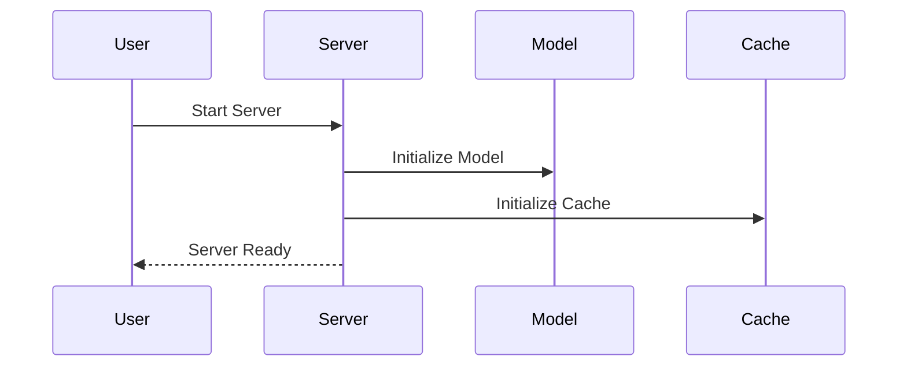
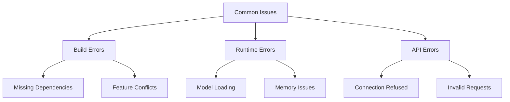
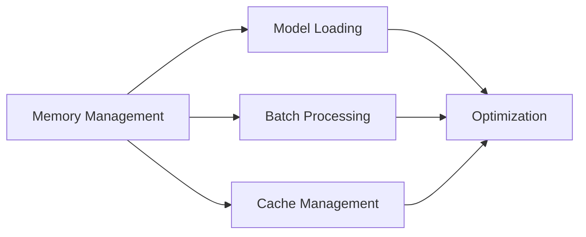

# Setup Guide

## Prerequisites

Before installing FastLLM, ensure you have the following prerequisites:

- Rust toolchain (1.75.0 or later)
- Cargo package manager
- Git
- (Optional) CUDA toolkit for GPU support
- (Optional) Metal for macOS GPU support

## Installation



### 1. Clone the Repository

```bash
git clone https://github.com/stacklok/fastllm
cd fastllm
```

### 2. Install Dependencies

The project uses several key dependencies:
- Axum for the web server
- Candle for ML operations
- Tokenizers for text processing
- HuggingFace Hub for model management

These are automatically managed by Cargo.

### 3. Configure Features

FastLLM supports different hardware backends through feature flags:



#### CPU-only Mode (Default)
```bash
cargo build --features cpu
```

#### CUDA Support
```bash
cargo build --features cuda
```

#### Metal Support (macOS)
```bash
cargo build --features metal
```

### 4. Configuration

Create a configuration file `config.json`:

```json
{
    "model": {
        "type": "mistral",
        "path": "/path/to/model",
        "max_tokens": 2048,
        "temperature": 0.7
    },
    "api": {
        "host": "127.0.0.1",
        "port": 3000
    },
    "cache": {
        "enabled": true,
        "path": "/path/to/cache"
    }
}
```

## Environment Setup

### Environment Variables

```bash
# Model configuration
export FASTLLM_MODEL_PATH="/path/to/model"
export FASTLLM_TOKENIZER_PATH="/path/to/tokenizer"

# API configuration
export FASTLLM_HOST="127.0.0.1"
export FASTLLM_PORT="3000"

# Cache configuration
export FASTLLM_CACHE_DIR="/path/to/cache"
export FASTLLM_OFFLINE="0"
```

## Running the Server



### Start the Server

```bash
cargo run --release
```

The server will start and listen on the configured port (default: 3000).

## Verification

### 1. Check Server Status

```bash
curl http://localhost:3000/health
```

### 2. Test Chat Completion

```bash
curl -X POST http://localhost:3000/v1/chat/completions \
  -H "Content-Type: application/json" \
  -d '{
    "messages": [
      {
        "role": "user",
        "content": "Hello, how are you?"
      }
    ]
  }'
```

### 3. Test Embeddings

```bash
curl -X POST http://localhost:3000/v1/embeddings \
  -H "Content-Type: application/json" \
  -d '{
    "input": "Hello, world!",
    "model": "mistral-7b"
  }'
```

## Troubleshooting

### Common Issues



1. **Build Errors**
   - Ensure Rust toolchain is up to date
   - Check feature flag combinations
   - Verify system dependencies

2. **Runtime Errors**
   - Verify model paths
   - Check available system memory
   - Ensure proper permissions

3. **API Errors**
   - Verify server is running
   - Check port availability
   - Validate request format

## Performance Optimization

### Memory Usage



1. **Model Loading**
   - Use appropriate quantization
   - Enable model caching
   - Implement proper cleanup

2. **Request Handling**
   - Configure appropriate batch sizes
   - Implement request queuing
   - Monitor system resources

## Security Considerations

1. **API Security**
   - Implement authentication
   - Use HTTPS in production
   - Rate limiting

2. **Model Security**
   - Secure model storage
   - Validate model sources
   - Monitor model access

## Next Steps

1. Explore the API documentation
2. Review example implementations
3. Join the community
4. Report issues and contribute